# Ingesting Data into a Aazure Data Lake Storage Gen2 with Azure Data Factory

## Table of Contents

Summary 
Pre-requisite 
Scenario 
Part 1 – Create an Azure Data Factory (v2) 
Part 2 – Connect ADF to a code repository to begin using the ADF GUI 
Part 3 – Setting up the Connections in the ADF GUI (Azure SQL Database -> Blob) 
Part 4 – Setting up the Copy Activity in the ADF GUI (Azure SQL Database -> Blob) 
Part 5 – Using Parameters and Triggers (scheduling) in ADF GUI
 
### Summary
This tutorial walks through creating a pipeline copy activity to copy a file from a S3 storage location to an Azure Data Lake Storage Gen2 container, so we can prepare the file to be processed later for transformation.

In this lab we will: 
•	Show the graphical user interface for creating a pipeline 
•	Copy CSV file via a Copy Activity 
•	Copy Structed data from SQL Azure via a Copy Activity 
•	Use parameters to make the pipeline easy to change and more reusable 
 
### Prerequisites
•	Azure Subscription with rights to use/deploy Azure services, and X of Azure credit 
•	An ADLS Gen2 storage account with a filesystem (container) 
•	Azure Data Factory 
•	Visual Studio Team Services Git project (optional) 

### Part 1 – Create an Azure Data Factory (v2)
We are going to use the portal to create the Azure Data Factory.
1.	Go to Azure Portal- https://portal.azure.com. 
2.	Select **New** on the left menu, select **Analytics**, and then select **Data Factory**. 
    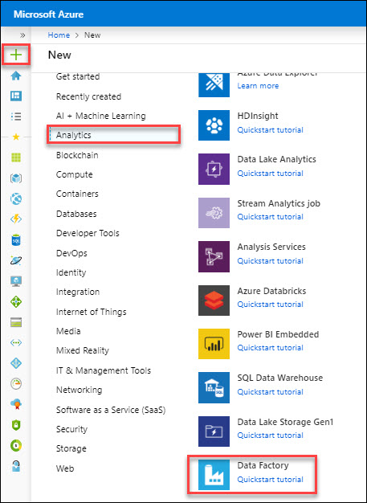 
3.	On the New data factory page, enter **ad-flab-adf** for Name.
4.	Make sure you select **Version** as **V2 (Pre-view)** 
   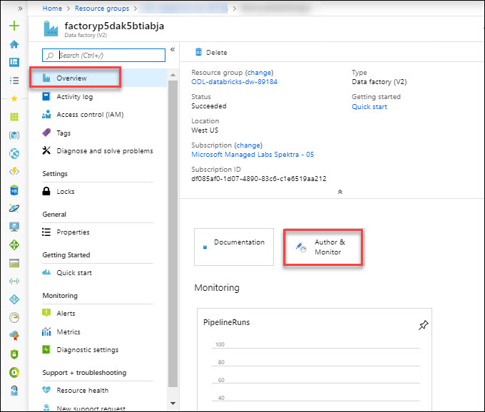 

``
Note: The name of the Azure data factory must be globally unique. Please modify the name if the Name validation fails. 
``

5.	After the creation is complete, you see the **Data Factory** page. Select the **Author & Monitor** tile to start the **Azure Data Factory** user interface (UI) application on a separate tab. 
   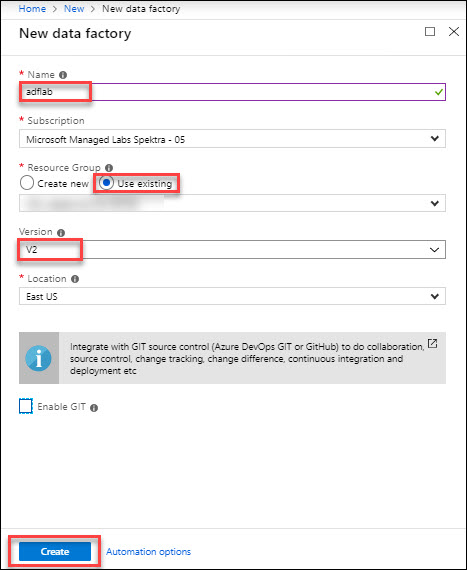 
 6. Go to **ADLS Gen2 storage accountt** in azure portal
   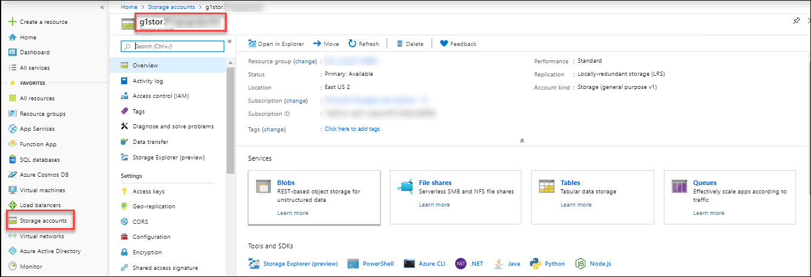 
7. Create **File Systems** in **adlsg2** storage account as per below instructions: 
   a. Name: **inputsql** 
   and Click **OK** 
   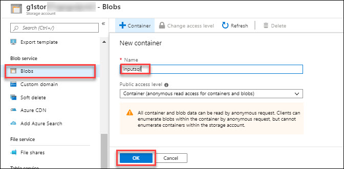   
   
### Part 2 – Connect ADF to a code repository to begin using the ADF GUI (Optional)
One option to be able to sync our code is to connect ADF to a code repository. This section walks through the steps to connect ADF to a Visual Studio Team Services Git project, so we can save our code for later re-use. Note that this is not required but a recommended best practice.

1.	Navigate to the **Azure portal** within your web browser and navigate to https://portal.azure.com
2.	Open the Azure Data Factory blade **adflab-adf**.
3.	In the Overview Blade, Click on **Author and Monitor** 
    
4.	Click the **Set up Code Repository** button to begin connecting this Azure data factory to a code repository. 
   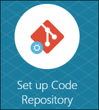 
5.	You can either create a new VSTS account for this lab or use an existing one. You can create a new one -[Here](https://app.vsaex.visualstudio.com/signup/?mkt=en-US&acquisitionType=byDefault) and configure it in ADF GUI under repository settings. You need to create/ select a Project under this Account. 
   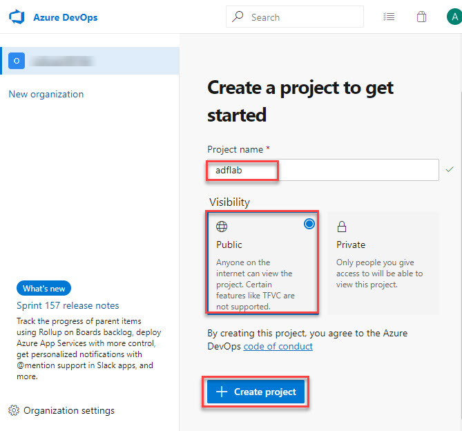 
6.	The Repository Settings pane will appear on the right. 
   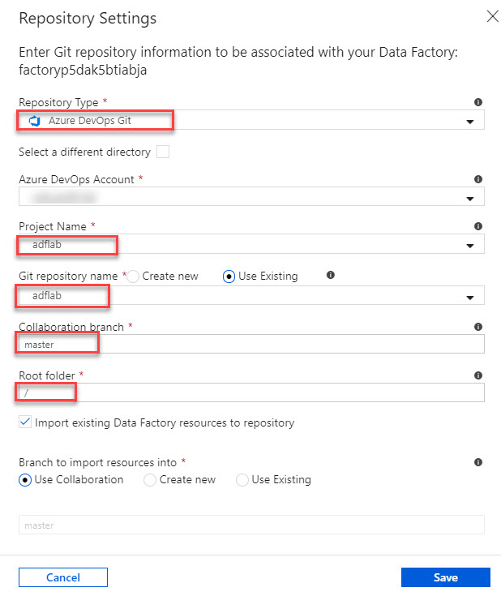 
7.	Select **Use Exiisting** in select working branch page and click the **Save** button when you have verified your settings.

### Part 3 – Setting up the Connections in the ADF GUI (Azure SQL Database -> Blob)
We now want to use the GUI to create another copy activity in the same pipeline to copy the Data from Azure SQL DB to Azure blob storage to be ready for transformation along with the earlier CSV file. Our first step is setting up the connections and linked services need for the source and destination.

1.	In the Left Menu click the **Connections** menu item.
2.	In the right pane you need to **Select** working branch as **Master**. 
   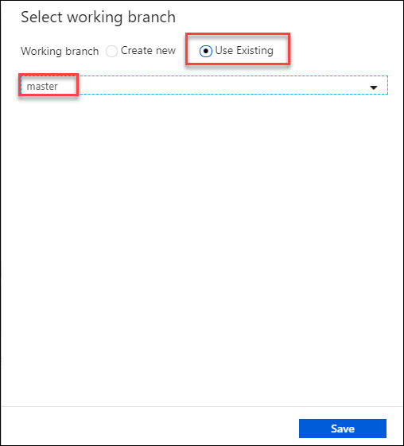 
3.	Click the **+New** button under **Linked** Services. 
   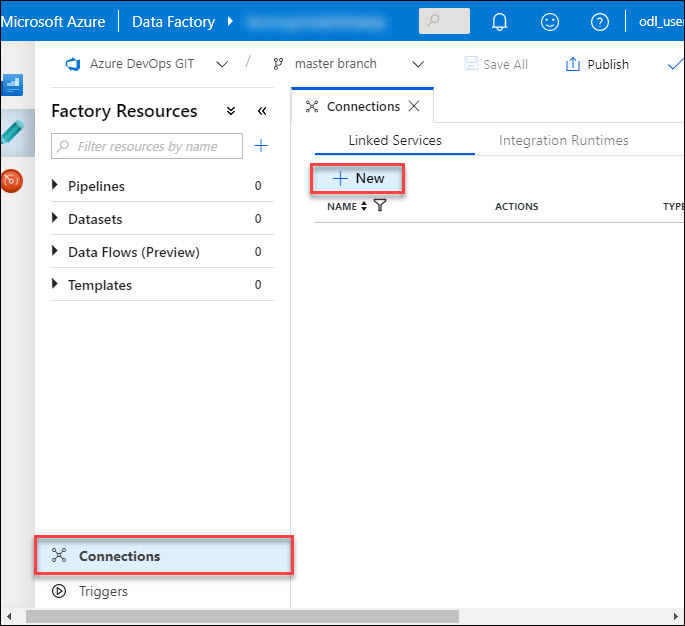 
4.	Click on the **Azure SQL Database** tile.
    
5.	Click **Continue**.
6.	In the right pane you should see the properties to configure the **Azure SQL Database** account.We will name this linked service AzureSqlData-base-Source and using the Default runtime. Use the following  
 
  * Account Selection Method -> **Manual**
  * Fully qualified domain name ->**adlabserver.database.windows.net**
  * Database name -> **adflab**
  * User name -> **lab_user**
  * Password -> **P@ssw0rd**

7.	Click the **Test Connection** to verify settings are entered correctly. 
   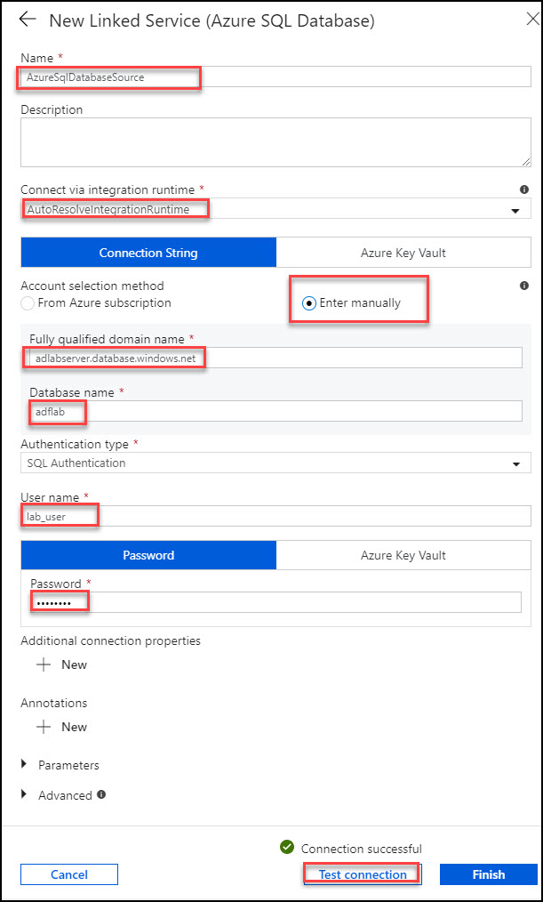 
8.	Click **Finish**.

### Part 4 – Setting up the Copy Activity in the ADF GUI (Azure SQL Database -> Blob)
We now want to use the GUI to create a Copy Activity in the pipeline to move the files from the Azure SQL Database as source to our Azure storage destination.

1.	Click the **Pipeline** in the left menu and then click the **+** sign for adding the pipepline.
2.	In the **Pipeline GUI**, drag the Copy activity (under Move & Transform) to the empty pane above General.
3.	Rename the activity to **AzureSQLtoADLSGen2**. 
4.	Click **Save**.
5.	Click the **Source** Tab in the **Copy Activity GUI**.
   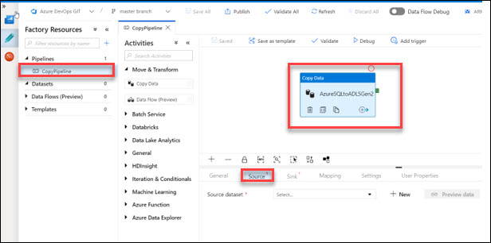 
6.	Click the **+New** button next to Source **Dataset**. 
7.	You should now see the list of source **dataset** connectors.
8.	Choose the **Azure SQL dataset** and click **Finish**.
    
9.	You should now set the connection property information as following.

   *	Name this **datasetAzureSqlTable** 
   *	Select Table -> **SalesLT.Customer** 
   *	Click **Preview Data** to preview the first several data rows. 
   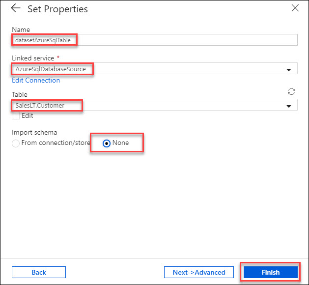 
10. Click on **Finish**.
11. Click on **CopyPipeline** and then click **AzureSQLtoADLSGen2** Activity.
12.	Select **Source -> Use Query -> Query**

``
SELECT CustomerID, CompanyName, SalesPerson, ModifiedDate 
FROM [SalesLT].[Customer]
``

``
Note: This Query may change based on your table selection. 
`` 
   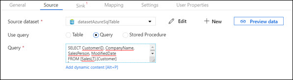 
13.	Click on **Preview data** to ensure the query works. 
14.	Click back on the **CopyPipeline**. 
15.	Click the **AzureSQLtoADLSGen2** copy activity. 
16.	Click the **Sink** Tab in the Copy Activity GUI. 
17.	Click the **+New** button next to **Source Dataset**. 
   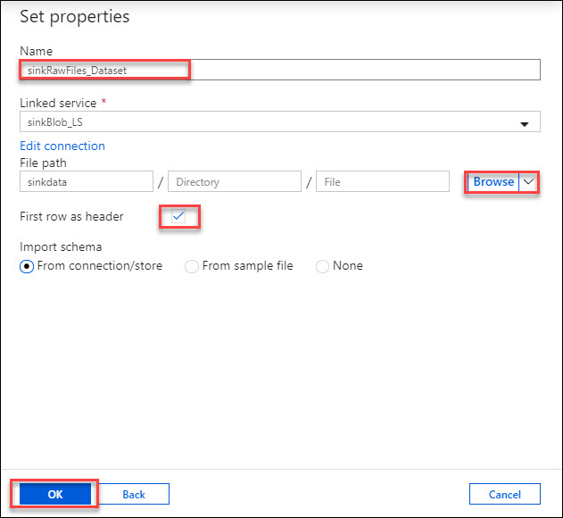 
18.	You should now see the list of sink dataset connectors. 
19.	Choose the **Azure Data lake Storage Gen2** dataset and click **Continue**.
   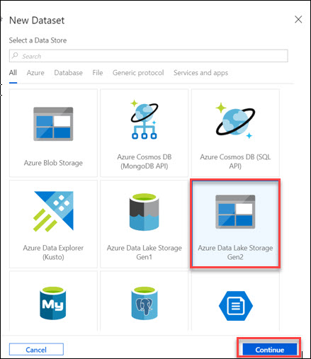 
20. Select the format as **DelimitedText** and click on **Conitnue**. 
   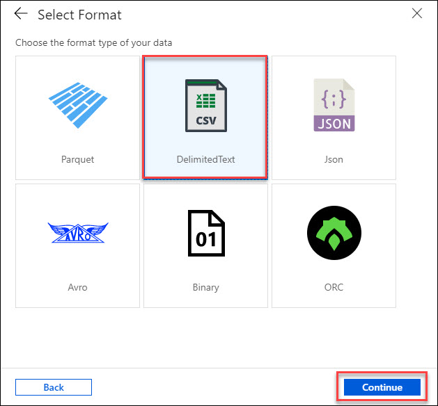 
21.	Name the dataset as **datasetADLSgen2fromSQL** 
22. Drop down for Linked Service and Click on **+New**. 
   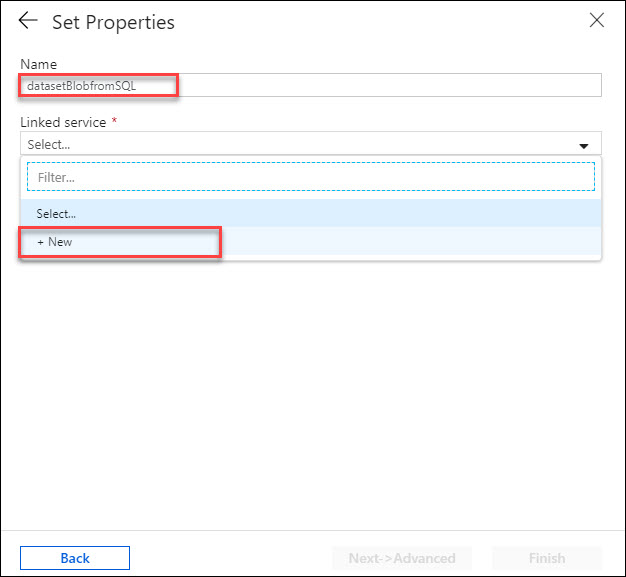 
23. Fill the instructions as following: 
   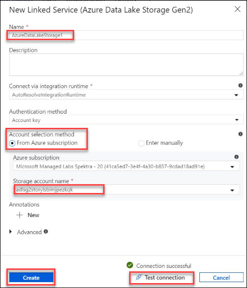 
24. **Test Connection** and Click the **Finish** button.   
25. Set the properties. Click browse button and drill down to the **inputsql** container. 
``
Note: Make sure **inputsql** container exists or else create one first. 
``

26.	Click the **Finish** button.
27.	Navigate to the **CopyPipeline**
28.	**Save** the changes. Click the **Debug** icon at the top menu to test and run our copy activity. 

### Part 5 – Using Parameters and Triggers (scheduling) in ADF GUI
You can define parameters at the pipeline level and pass arguments while you're invoking the pipeline on-demand or from a trigger. Activities can consume the arguments that are passed to the pipeline. Using parameters, you can build more flexible pipelines. 
And triggers can be used to execute the pipelines on a schedule or on-demand.

1.	Navigate to **CopyPipeline -> Parameters**. Add new parameter.
2.	Name it as **filename**, let the **Value** be empty. 
   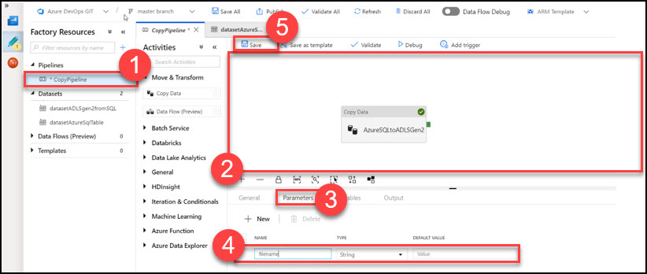 
3.	Click **Save**
4.	Navigate to **datasetADLSgen2fromSQL -> Parameters -> File Name**, and set the value as **@pipeline().parameters.filename** 
   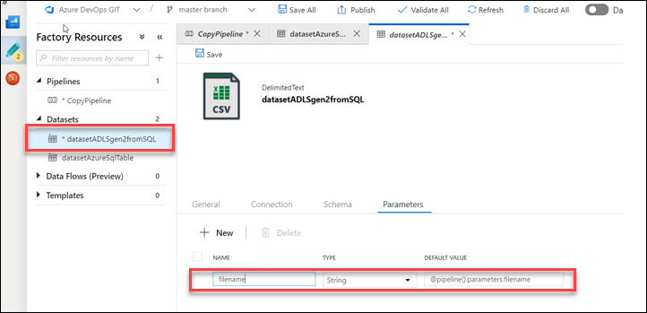 
5.	Navigate to the **CopyPipeline** and **Debug** it. 
    
6.	It will ask for an input parameter. Enter appropriate name and this will be used as the file name in sink. 
   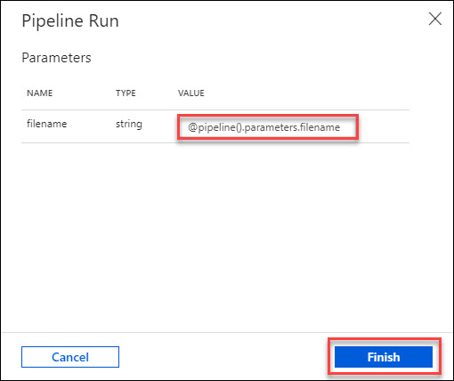 
7.	Click on **Finish** (and **Publish**). This will write the changes to Master.
10.	Click on **CopyPipeline -> Triggers -> Add** new trigger. 
9.	Enter the trigger properties accordingly. In this case, we create a daily tumbling window trigger. 
   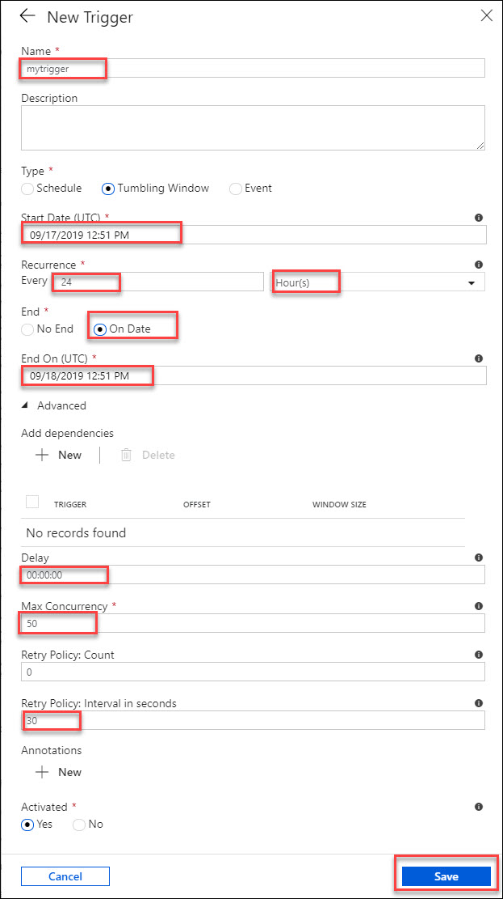 
Set Start, End time for **Trigger**. Check **Activated** check-box. 
11.	Click **Save**.
12.	In the **Trigger** Run Parameter window,Set **fileName -> copyfromsql_@{formatDateTime(trigger().outputs.windowStartTime, 'yyyy-MM-dd')}**

``
Note: Expressions can be changed based on requirements. 
``

13.	Click **Finish**.
Make sure you **‘Publish’** for the trigger to activated.
14.	Navigate to Monitoring section to see pipeline runs. 
   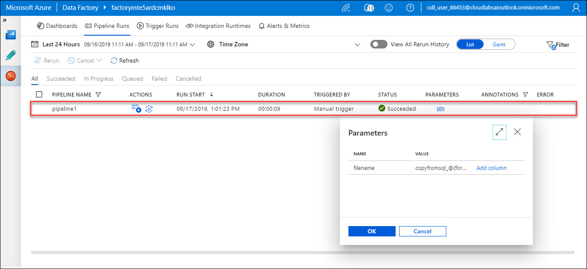 
15.	We can find the appropriate parameters being passed during each triggered run. 
16.	On Successful run of the CopyPipeline, navigate to the storage locations using Storage Explorer or Azure Portal (Storage Account), to verify the files copied. The filename would be defined by the parameter -> fileName.  
