# Lab03: Migrating a SQL Server to SQL DW 

## Table of Contents

Summary<br/>
Pre-requisites<br/>
Scenario<br/>
Part 1 – Loading data into Azure SQL Data Warehouse<br/>
Part 2 – Load Dimension tables<br/>
Part 3 – Create Partitioned Fact Table<br/>
Part 4 – Load data into partitioned staging tables from WASB<br/>
Part 5 – Copy Data into Correctly formatted tables via CTAS<br/>
Part 6 – Dynamic Management Views<br/>
**IMPORTANT: AVOID INCURRING EXTRA CHARGES - PAUSE YOUR SUBSCRIPTION RESOURCES**


## Summary
This tutorial walks through loading best practices for a SQL Data Warehouse. 
In this lab we will:<br/>
•	Create necessary objects to connect to Windows Azure Blob Storage (WASB) container<br/>
•	Load Dimension tables from a WASB container using best practices on distribution and indexes<br/>
•	Load a Fact table data from WASB container into a partitioned table via staging tables<br/>
•	Gain insight into the loading process via DMVs<br/>
``
The full set of scripts needed for this lab can be found on our VM under **Day-1\05.SQLDW** - Loading lab
``
 
## Pre-requisites
•	Azure Subscription with rights to use/deploy Azure services, and $200+ of Azure credit<br/>
•	 Software Requirement:<br/>
o	Visual Studio 2017 (SQL ops studio)<br/>
o	Portal query editor<br/>
o	SQL Server Data Tools 2016 (SSDT).<br/>
•	SQL Data Warehouse<br/>
•	Data in Windows Azure Storage Blob<br/>
•	Access via portal to the storage blob<br/>

## Scenario
During the Airlift, we will to Part 1 together.   In the lab we will use demo data that is already provided on a shared blob storage.

### Part 1a – Loading Blob storage data into Azure SQL Data Warehouse
We have created our SQL Data Warehouse and now we want to load data into it.  We can do this through the traditional ways of ETL and tooling such as SQL Server Integration Services or third-party tooling.  However, today we are going to use Polybase. Your source data has been precreated and is in your Azure Blob Storage account.<
 
1. From your virtual machine navigate to the **Azure portal** within the web browser which should be open from the last exercise.  If not, open the browser and navigate to https://portal.azure.com<br/>
2. Open the **Azure SQL Data Warehouse** blade from the tile on the portal dashboard (you pinned it in the earlier exercise).<br/>
    <br/>
3. Looking at the **Overview** blade you can see the **Common Tasks** as shown in the screen shot.<br/>
    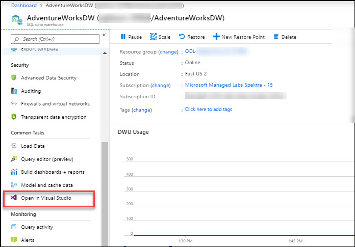<br/>
4. Click the **Open in Visual Studio** button.<br/>
    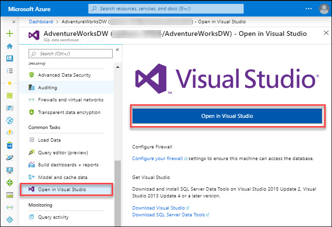<br/>
```
Note: Before opening Visual Studio click on Configure your firewall to make sure that your ClientIP has been added to the rules.
```

5. Click **Open Link** on the dialog box that ap-pears. **Visual Studio** will now launch.<br/>
    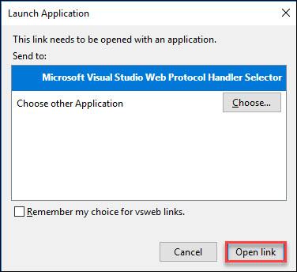<br/>
6. Sign in with your given **Azure Credentials**.<br/>
    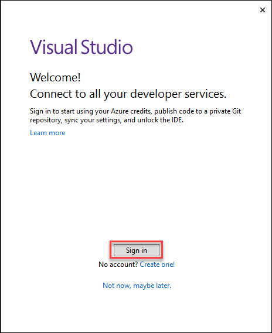<br/>
7. Fill in the **password** specified in **Environment Detail Page**.<br/>
    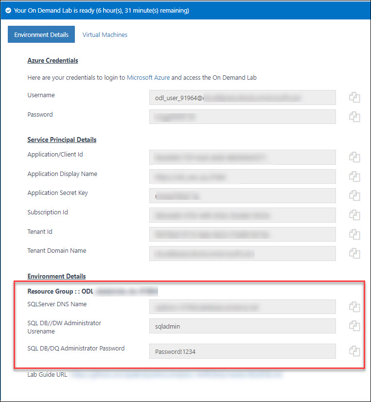<br/>
    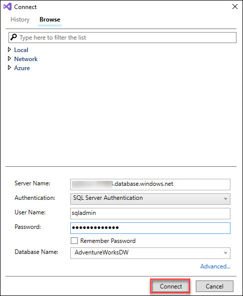<br/>
8. Click **Connect**.<br/>
9. **Expand** the object tree within the **SQL Server** object explorer pane.<br/>
10. Right click the database name and select **New Query**.  A new query window will open<br/>
    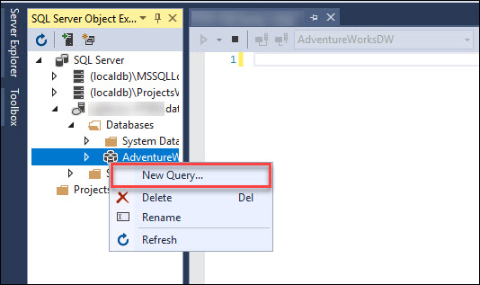<br/>
11. Open the **Setup** file that can be found in the **LabContent** folder in your drive C:\ under **Day-1\05.SQLDW** - Loading lab from visual studio.<br/>
    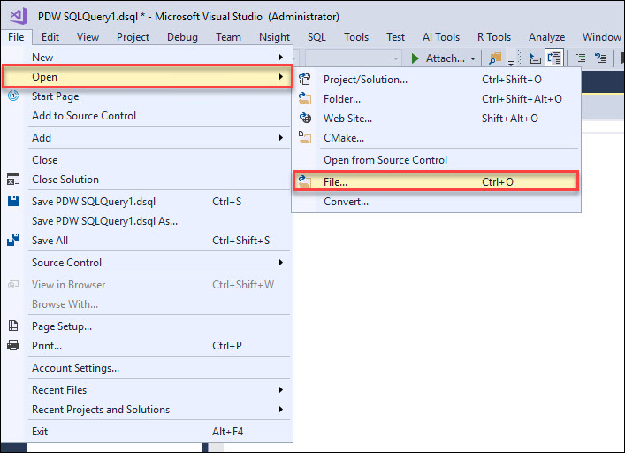<br/>
    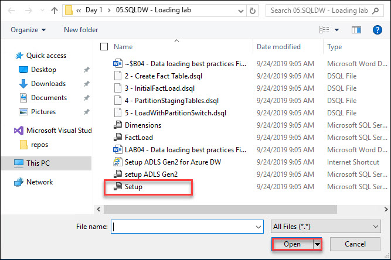<br/>
12. Copy the content of **Setup** script and paste it in new query window.<br/>
    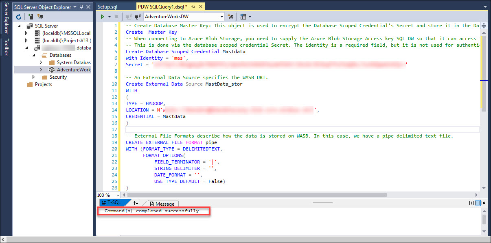<br/>
13. Execute the **Query**.

### Part 2 – Load Dimension tables
Now, we have created our external data source we can query and load the data we have in the Azure Blob Store.In the following lab we will load dimension tables into our SQL DW. Dimension tables are often a good first step because they are relatively small and this will allow you to gain an understanding of how to load data into SQL DW from WASB. 

1. Open the **Dimensions** file that can be found in the **LabContent** folder in your drive C:\ under **Day-1\05.SQLDW** - Loading lab from visual studio.<br/>
    <br/>
    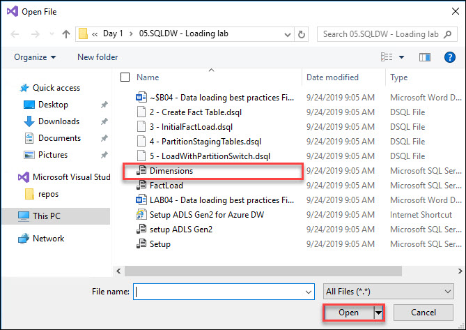<br/>
2. Copy the **Dimensions.sql** script and replace it with the existing script in query window.<br/>
    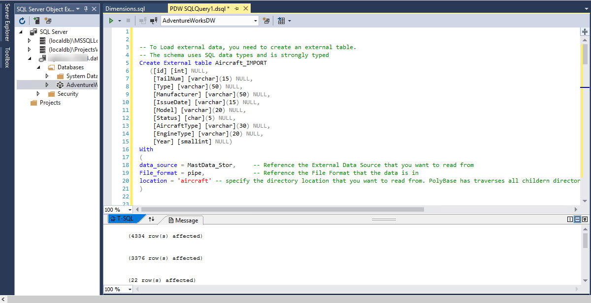<br/>
2. Execute the **Query**.<br/>
3. Go through the Content inside the dimension for understanding the script:<br/>
a. Using the following script to create an external table called Aircraft_IMPORT
```
Note: 
•	data_source - References the Ex-ternal Data Source that you want to read from

•	File_format - References the File Format that the data is in

•	location - Specifies the directory lo-cation that you want to read from. PolyBase traverses all childern di-rectories and files from a stated filepath.
```
```
CREATE EXTERNAL TABLE Aircraft_IMPORT
   ([id] [int] NULL,
	[TailNum] [varchar](15) NULL,
	[Type] [varchar](50) NULL,
	[Manufacturer] [varchar](50) NULL,
	[IssueDate] [varchar](15) NULL,
	[Model] [varchar](20) NULL,
	[Status] [char](5) NULL,
	[AircraftType] [varchar](30) NULL,
	[EngineType] [varchar](20) NULL,
	[Year] [smallint] NULL)
WITH
(
DATA_SOURCE = MastData_Stor,     
FILE_FORMAT = pipe,              
LOCATION = 'aircraft'
)
```

b. Use the following **CTAS** script to create the table and load data<br/>
```
Note:
* 	Make sure that you select * From Aircraft_IMPORT  you just created.<br/>
* 	Run the following script to update Statstics<br/>
* 	Auto update statistics can take care of automatically updating single column stats, but in this case it is multi-column stats
```
```
CREATE TABLE Dim_Aircraft
WITH
(
  DISTRIBUTION = ROUND_ROBIN
, CLUSTERED INDEX (id)                      
)
AS SELECT * FROM Aircraft_IMPORT    
CREATE STATISTICS Aircraft_Stat 
ON 
Dim_Aircraft (id, type, manufacturer)
```
3. Remainder code will load the all dimension tables.

### Part 3 – Create Partitioned Fact Table
To effectively leverage a partition swap load, a table has to exist with an exisiting partition scheme. To do this you must create an empty table with a partitioning scheme.

1. To create an empty table partioned by DateID. Open the **2 - Create Fact Table** file that can be found in the **LabContent** folder in your drive C:\ under **Day-1\05.SQLDW** - Loading lab from visual studio.<br/>
    <br/>
    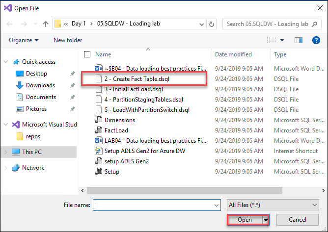<br/>
2. Copy the 2 - **Create Fact Table.dsql** script and replace it with existing content in query window.<br/>
    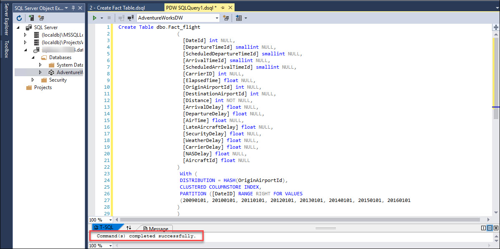<br/>
3. To load the staging tables from WASB into SQDL DW. 
4. Open the **3 - InitialFactLoad.dsql** file that can be found in the **LabContent** folder in your drive C:\ under **Day-1\05.SQLDW** - Loading lab from visual studio.<br/>
    <br/>
    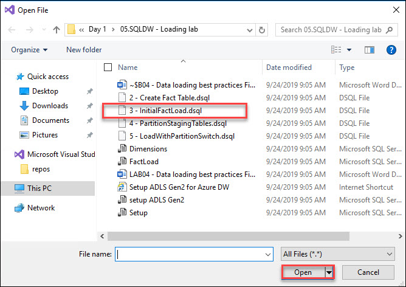<br/>
5. Copy the 3 - **InitialFactLoad.dsql** script and replace it with existing content in query window <br/>
    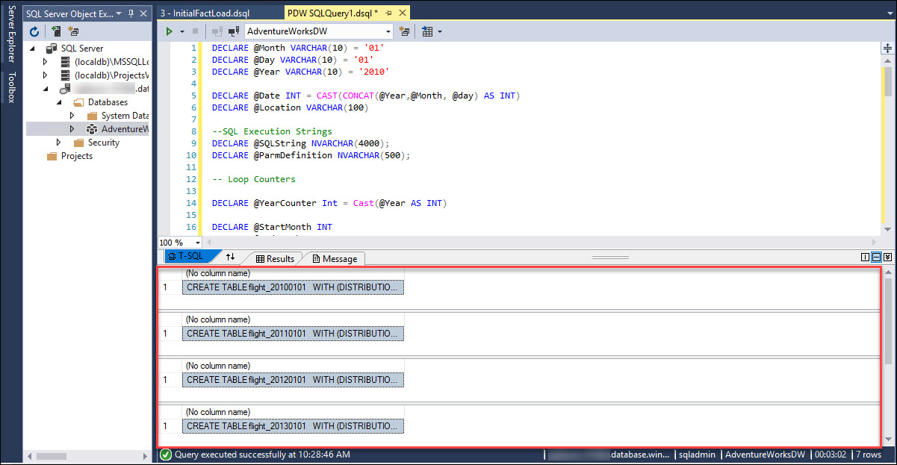<br/>
```
Note: 
•	We are using Round_Robin distribution and a Heap because we want to ensure that the load occurs as quickly as possible. Remember ELT.
•	Use CTAS external table and create a local table.
```

### Part 4 – Load data into partitioned staging tables from WASB
In the next set of steps we are going to take the staging tables we created in part 3 and prep the data for a partition switch.

1. Open the **4 - PartitionStagingTables.dsql** file that can be found in the **LabContent** folder in your drive C:\ under **Day-1\05.SQLDW** - Loading lab from visual studio.<br/>
    <br/>
    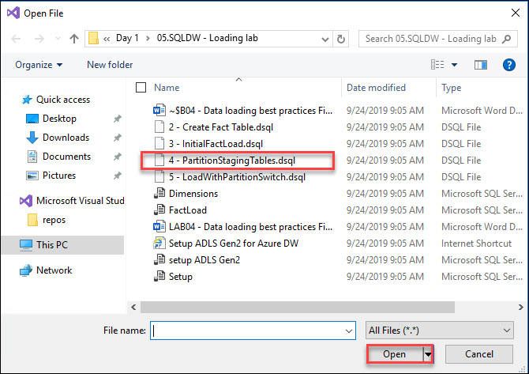<br/>
2. To complete the staging table prep. Copy the script and replace it with existing content in query window <br/>
    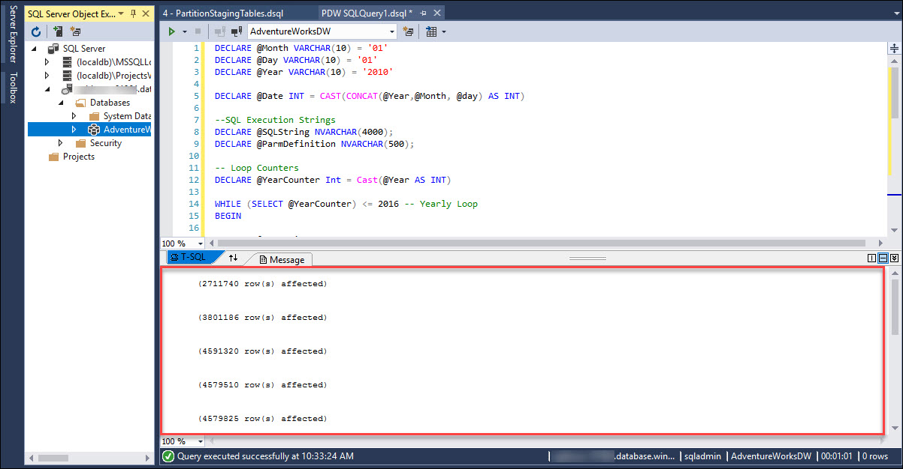<br/>

### Part 5 – Copy Data into Correctly formatted tables via CTAS
Now that we have a set of partitioned tables and an empty fact table, we can start doing partition switches into the table.

1. The next script that you will run loops through the partitioned tables and dynamically switches the partitions.  Because this operation is on the metadata, there is relatively little downtime for the amount of data "loaded" into the production fact table.

Open the 5 -**LoadWithPartitionSwitch.dsql** file that can be found in the **LabContent** folder in your drive C:\ under **Day-1\05.SQLDW** - Loading lab from visual studio.<br/>
    <br/>
    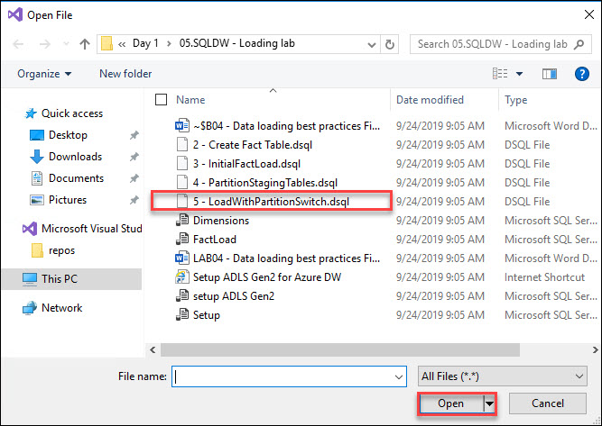<br/>
2. To switch the partitions on your empty fact table. Run the following script that is part of 5 -**LoadWithPartitionSwitch.dsql** script and replace it with existing content in query window.
    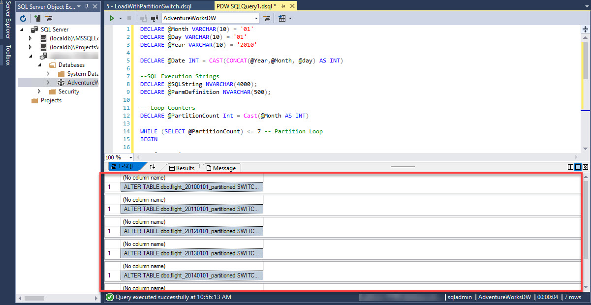<br/>
