# ETL with Azure Data Factory (Dataflow) – Setup Instructions

## Overview

In this tutorial, you'll use the Azure Data Factory user interface (UX) to create a pipeline that copies and transforms data from an Azure Blob Storage to an Blob Storage sink using mapping data flow. The configuration pattern in this tutorial can be expanded upon when transforming data using mapping data flow

In this tutorial, you do the following steps:
1. Create Linked Service and Datasets.
2. Build a mapping data flow with six transformations.
3. Create a pipeline with a Data Flow activity.
4. Test run the pipeline.
5. Check a Data Flow activity Result in Blob Storage

### Prerequisite:
1. Create a blob storage account and a container called **sinkdata** to be used as sink. Keep a note of the storage account name, container name and Access key will be referenced later in the template.<br/>
   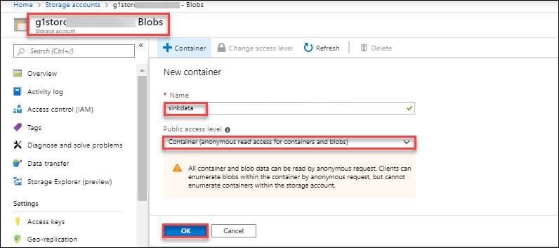<br/>
2. Go to **Storage Explorer (preview)** -> **BLOB CONTAINERS** -> **sinkdata** -> **+ New Folder** and give instructions as below:<br/>
    a. Name: **staged_sink**<br/>
    Click Ok<br/>
   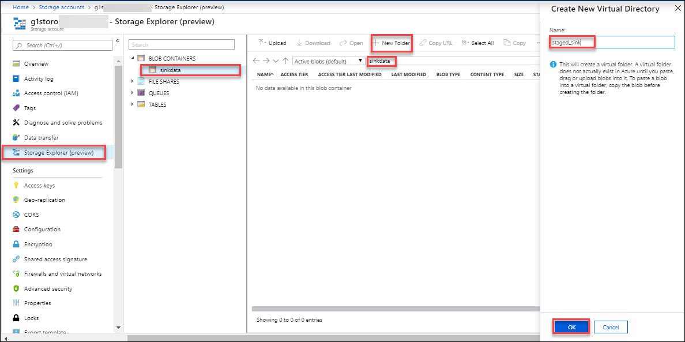<br/>    
3. Now, Upload **any** file in that **staged_sink** folder.<br/>
   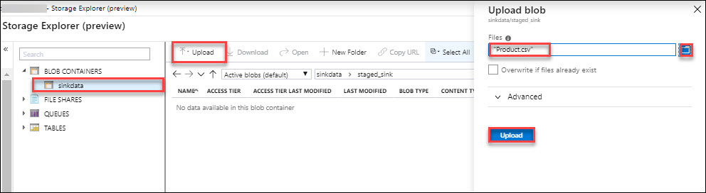<br/>
   
## Create Linked Service and Datasets

1. In Azure Portal, go to **Resource Group** and **Click** on azure data factory.<br/>
 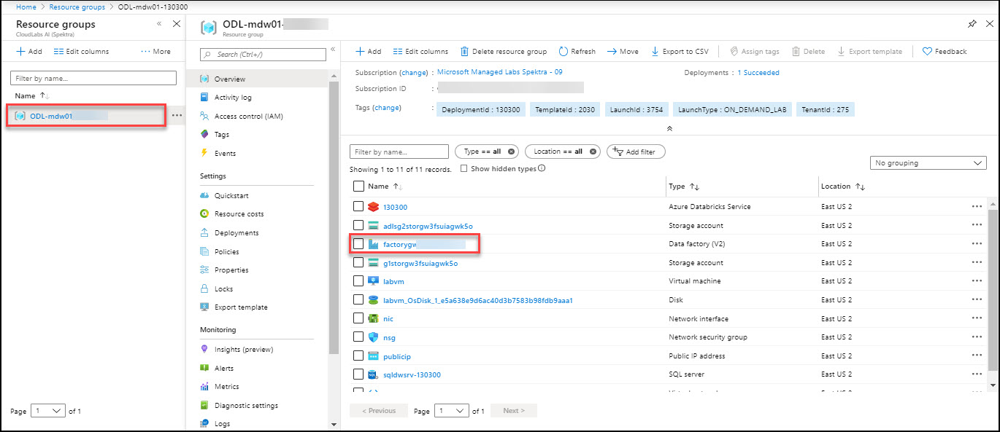<br/>
2. Select **Author & Monitor** to launch the Data Factory UI in a separate tab.<br/>
 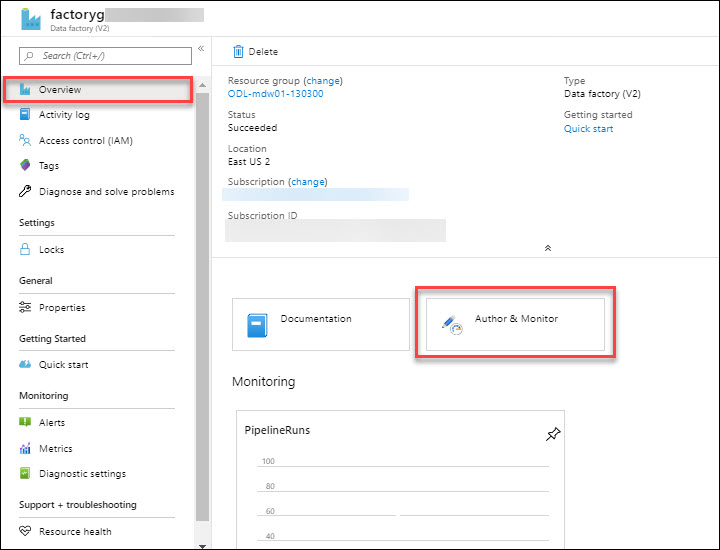<br/>
1.	Create new **linked services** in ADF UI by going to **Connections** -> **Linked services** -> **+ new**<br/>
a.	**Source** – for accessing source data. You can use the public blob storage containing the source files for this sample.<br/>
Select **Blob Storage**, use the below **Account Key** to connect to source storage.<br/>
```
Storage Account Name: <-Given in your environment page->
Storage Account Key: <-Given in your environment page->
```
  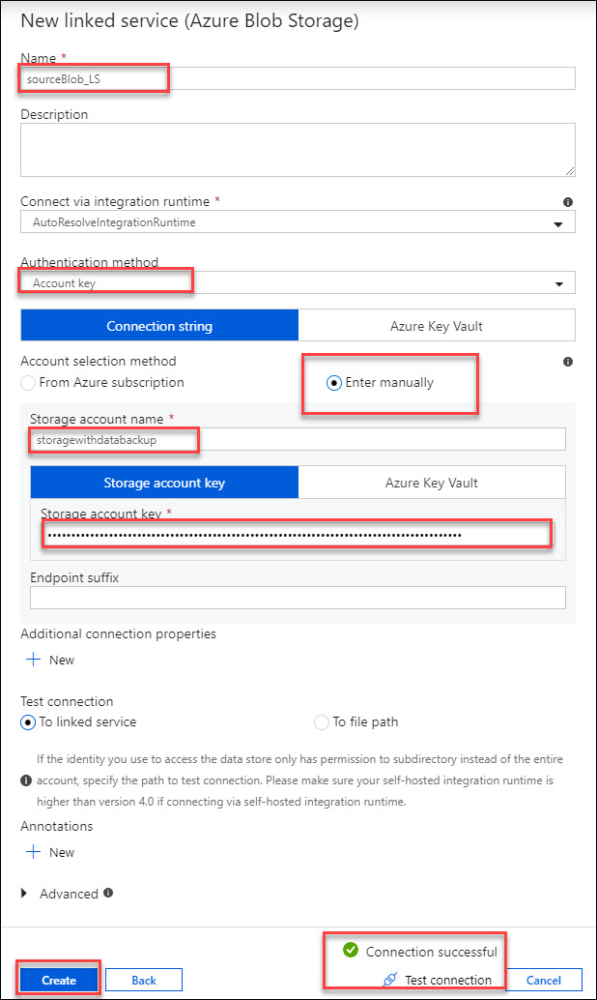<br/>
b.	**Sink** – for copying data into.<br/>
Create a new linked service. Select a storage created in the **prerequisite**, in the sink linked service.<br/>
  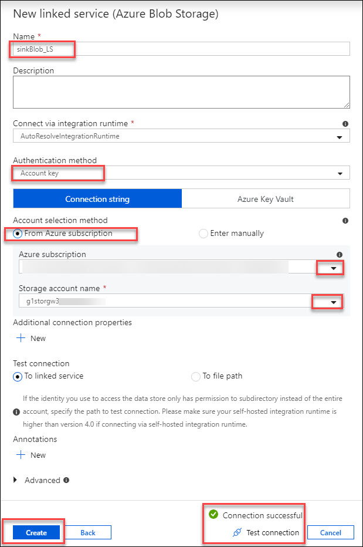<br/>
2.	Create **datasets**<br/>
a. Add **Dataset** as shown in image:<br/>
  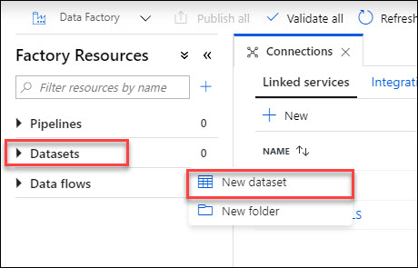<br/>
b.	Create **'sourceFiles_Dataset'** to check if source data is available.<br/>
   i. Select a data store as **Azure Blob Storage**
   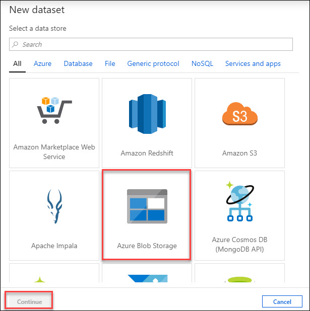<br/>
   ii. Select the fromat type as **DelimitedText** of your data.
   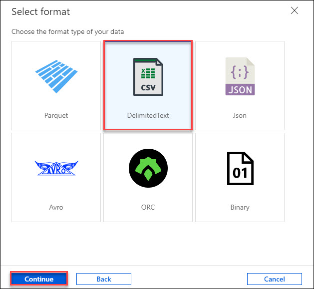<br/>
   iii. Now, create as **'sourceFiles_Dataset'** and follow instructions as below:<br/>
    **Linked service** - select **sourceBlob_LS**<br/>
    **File path** - **data/source/Product.csv**<br/>
    Select the **First Row as Header**<br/>
   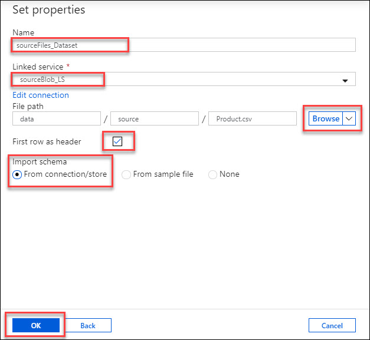<br/><br/>
c.	**Sink dataset** – for copying into the sink destination location<br/>
   i. Select a data store as **Azure Blob Storage**<br/>
   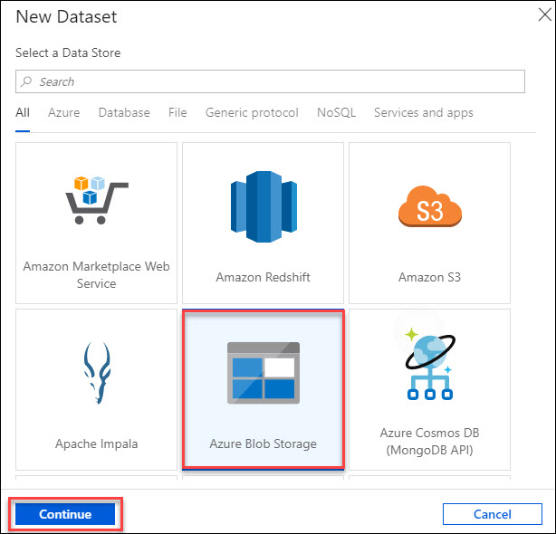<br/>
   ii. Select the fromat type as **DelimitedText** of your data.<br/>
   <br/>
   iii. Now, create as **'sinkRawFiles_Dataset'** and follow instructions as below:<br/>
   **Linked service** - select **sinkBlob_LS**<br/>
   **File path** - **sinkdata/staged_sink**<br/>
   Select the **First Row as Header**<br/>
   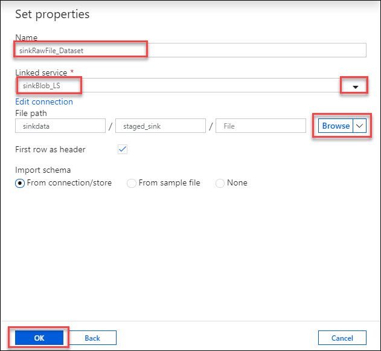<br/><br/>
   
### Build a mapping data flow with six transformations.

1. In the factory top bar, slide the Data Flow debug slider on. Debug mode allows for interactive testing of transformation logic against a live Spark cluster. Data Flow clusters take 5-7 minutes to warm up and users are recommended to turn on debug first if they plan to do Data Flow development. For more information, see Debug Mode.<br/>
   <br/>
2. In Factory Resouces, select Data flows and add **New Data flow**. Select **Mapping Data Flow** while creating DataFlow. Once you create your Data Flow, you'll be automatically sent to the data flow canvas. In this step, you'll build a data flow that takes the Product.csv in Blob storage.<br/>
   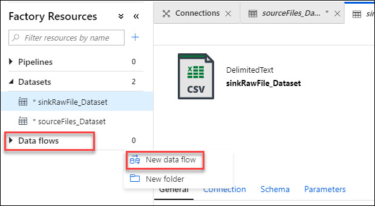<br/>
   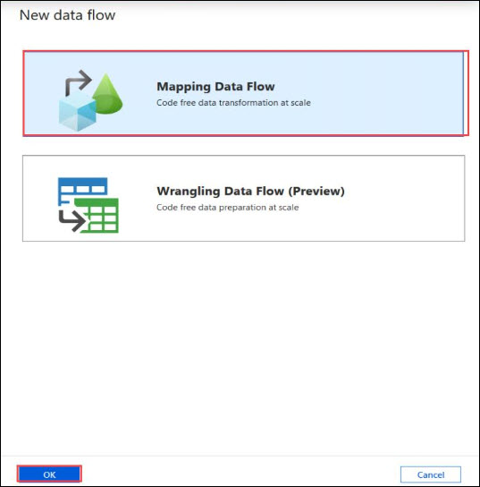<br/>
3. In the data flow canvas, add a source by clicking on the **Add Source** box<br/>
   * Name: **Give any name**<br/>
   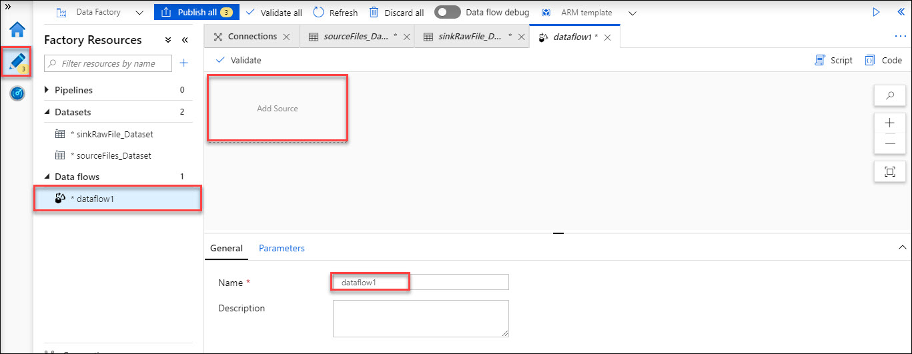<br/>
4. Name your source **Source**. Select **sourceFiles_Dataset** from dropdown.<br/>
   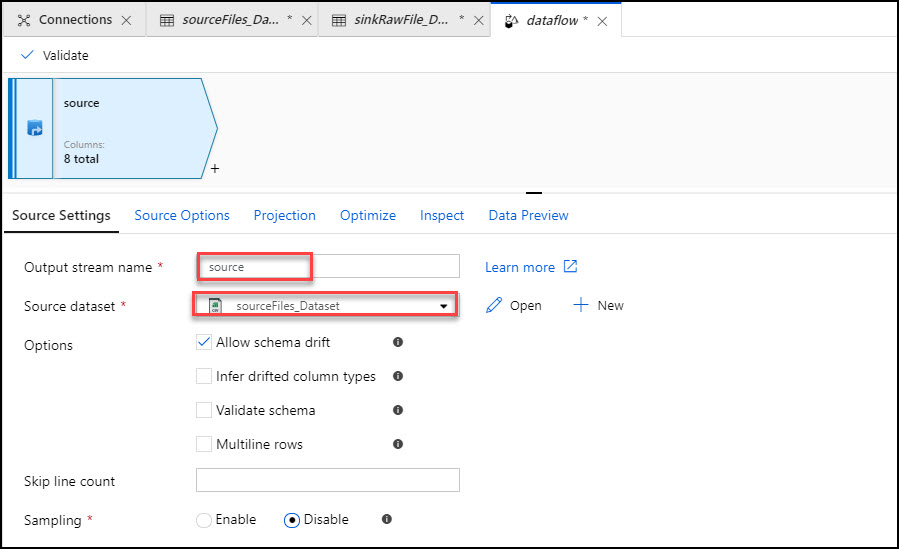<br/>
5. If your debug cluster has started, go to the Data Preview tab of the source transformation and click Refresh to get a snapshot of the data. You can use data preview to verify your transformation is configured correctly.<br/>
6. Next to your source node on the data flow canvas, click on the plus icon to add a new transformation. The first transformation you're adding is a **Derived Colunm**. The Derived Column transformation in ADF Data Flows is a multi-use transformation. While it is generally used for writing expressions for data transformation, you can also use it for data type casting and you can even modify metadata with it.<br/>
   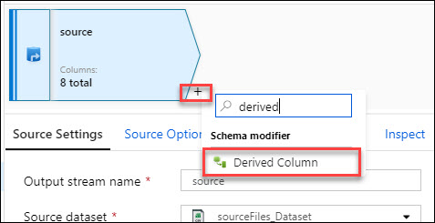<br/>
7. Name your **Derived Colunm** transformation **Casting**. Add Colunm and define the expression as shown below image:<br/>
   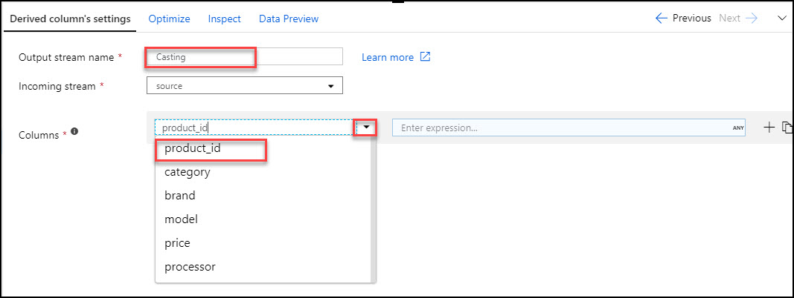<br/>
8. Add below expression in **Expression for field**<br/>
``
toInteger(product_id)
``
   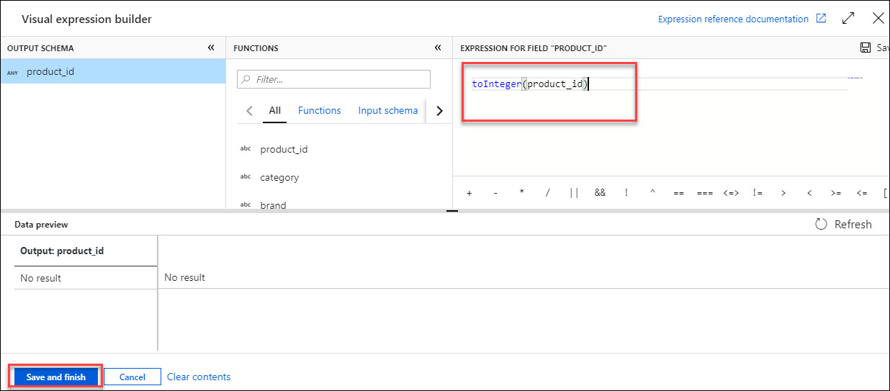<br/>
   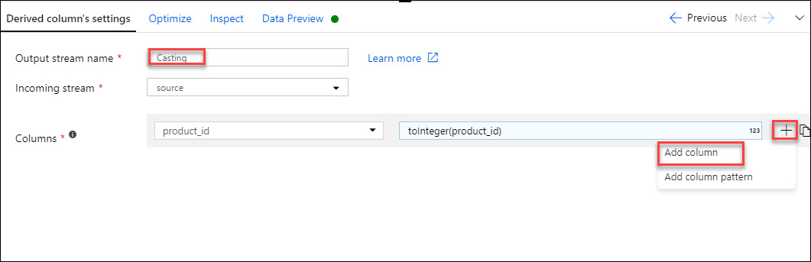<br/>
9. Add other columns **product_id**, **category**, **brand**, **model**, **size**, and **price**. Add new colunm as **doublePrice** and in expression field give **toFloat(price)** as a value.<br/>
   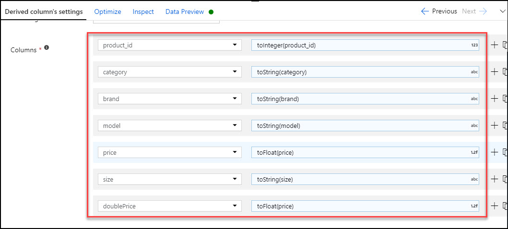<br/>
10. The next transformation you'll add is an **Select** transformation under **Schema modifier**.<br/>
   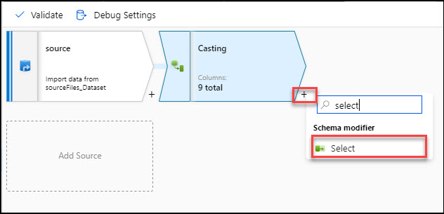<br/>
11. Using select transformation will Rename the **product_id** to **prodID**. Name your **Select** transformation as **UpdateName**.<br/>
   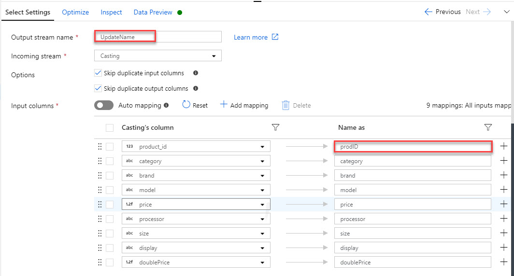<br/>
12. The next transformation you'll add is an **Derived Colunm** transformation. Will use this transformation for doublePrice, and multiply the price column by 2. This is for demonstration, in reality you would populate the field using some business logic to make it more meaningful.<br/>
   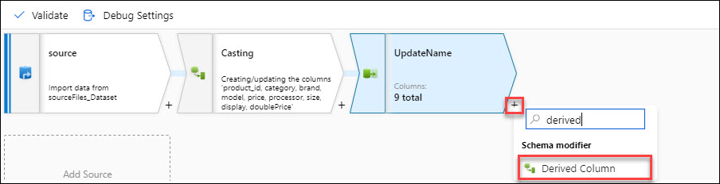<br/>
13. Name the transformation as **Double Price**. In **Colunms** section, select **doublePrice**.<br/>
   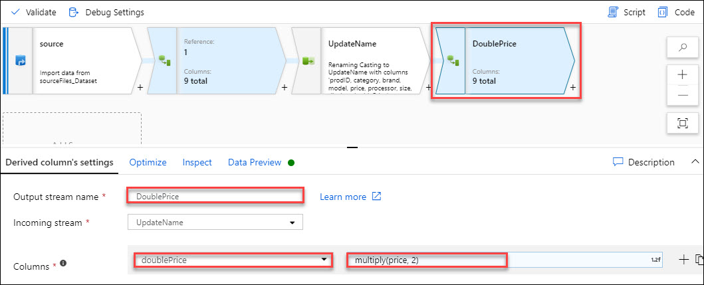<br/>
14. Add following expression and save the expression:<br/>

``
multiply(price, 2)
``
   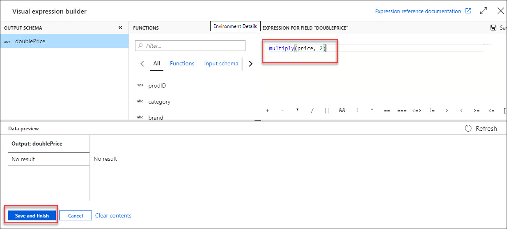<br/>
15. The next transformation you'll add is an **sort** transformation under **Row modifier**. Will sort the price column in descending order.<br/>
16. Name the transformation as **Sort** and sort the condition as below:<br/>
   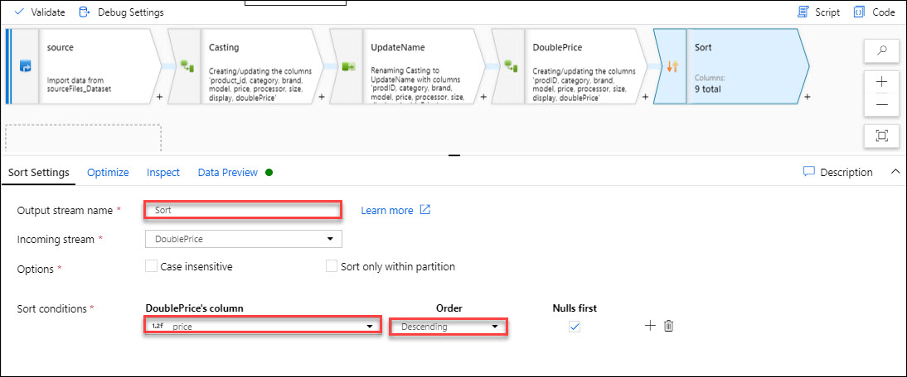<br/>
17. Next, you want to add a **Sink** transformation under Destination.<br/>
   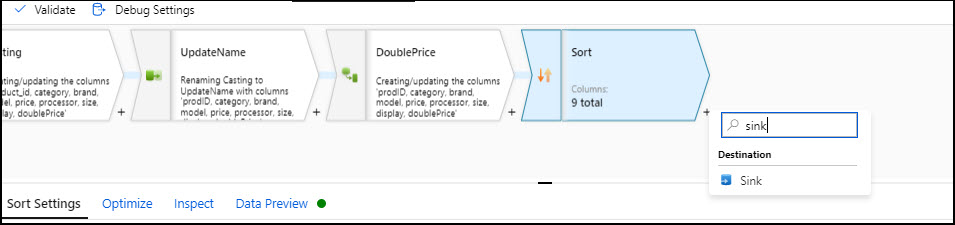<br/>
18. Name your Output stream as **Sink**. Select the **sinkRawFiles_Dataset** dataset from drop down.<br/>
   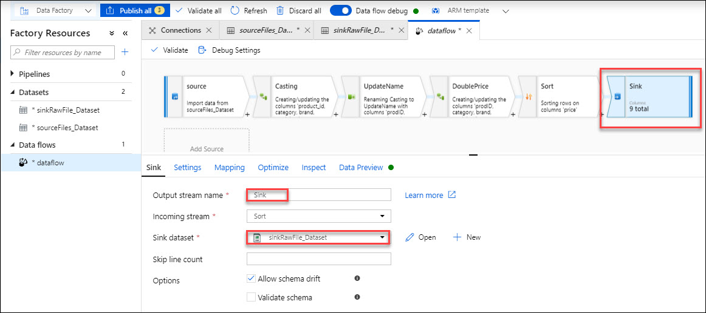<br/>
19. Click on **Publish All** for saving the all solution.

Now you've finished building your data flow. You're ready to run it in your pipeline.

### Running and monitoring the Data Flow

You can debug a pipeline before you publish it. In this step, you're going to trigger a debug run of the data flow pipeline. While data preview doesn't write data, a debug run will write data to your sink destination.<br/>

1. Add Pipeline **Factory Resources**.<br/>
   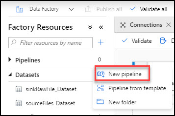<br/>
2. In the Activities pane, expand the **Move and Transform** accordion. Drag and drop the Data Flow activity from the pane to the pipeline canvas.<br/>
   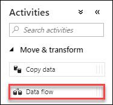<br/>
3. In the Adding Data Flow pop-up, select **Use existing Data Flow** and select **dataflow** from drop down. Click Finish when done.<br/>
   <br/>
4. Go to the pipeline canvas. Click Debug to trigger a debug run.<br/>
   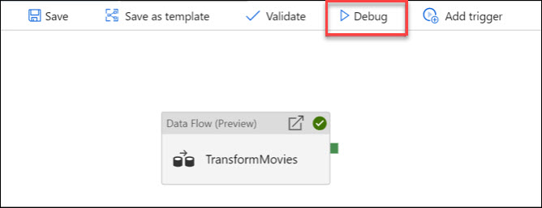<br/>
5. Pipeline debug of Data Flow activities uses the active debug cluster but still take at least a minute to initialize. You can track the progress via the Output tab. Once the run is successful, click on the eyeglasses icon to open the monitoring pane.<br/>
6. Go back to your Azure portal and open Blob Storage -> Containers -> sinkdata -> staged_sink. Download the **Product.csv** using the URL and check the CSV file result<br/>
  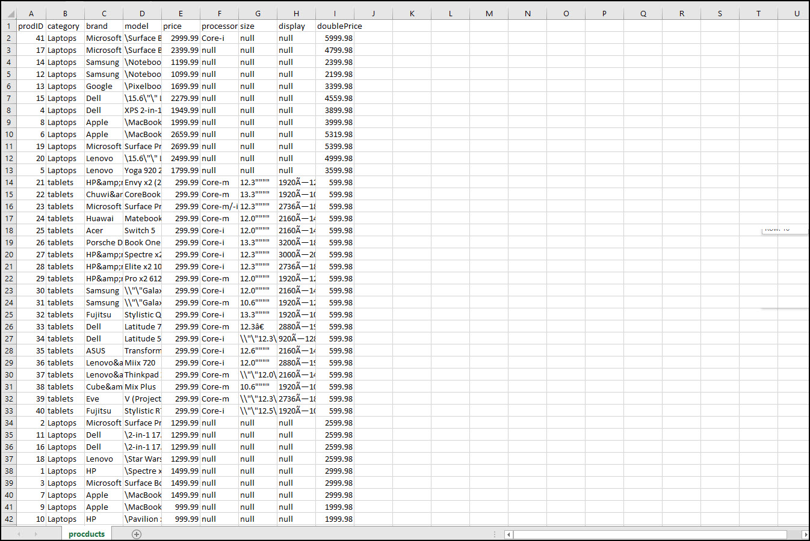<br/>

